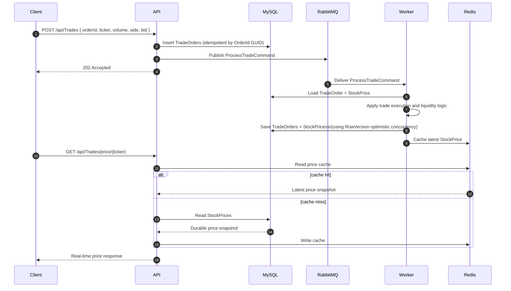
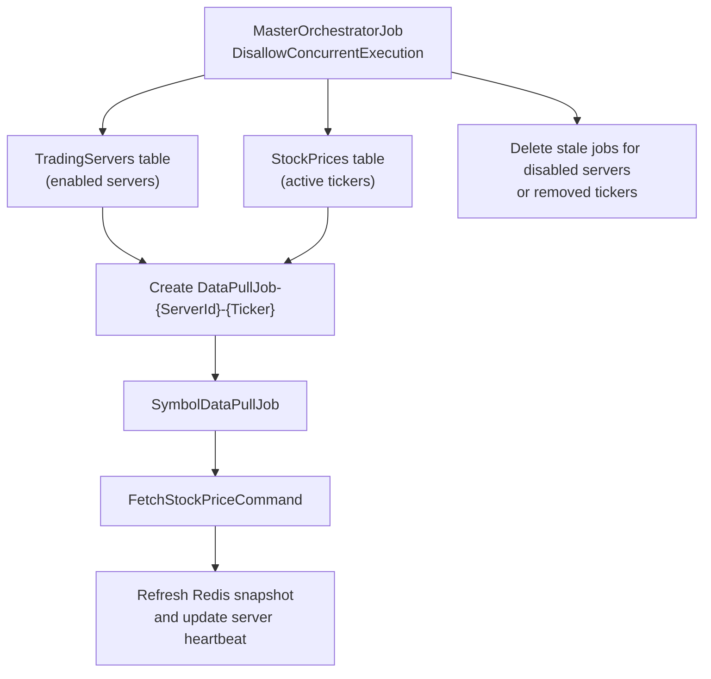

# TradingSystemDemo

## What this solution demonstrates

This solution is a hybrid demo that combines two ideas:

1. A Quartz.NET-based distributed scheduler that manages per-server symbol polling jobs.
2. A trading pipeline that demonstrates cache-aside reads with Redis, durable writes in MySQL, asynchronous work distribution through RabbitMQ, and optimistic concurrency in the worker.

The goal is to show how a system can:

- Accept trade requests through an API.
- Save the write model in MySQL first.
- Push processing work to RabbitMQ.
- Let a background worker update the durable market state.
- Publish the latest read model to Redis for high-speed price reads.
- Use Quartz to dynamically create and manage symbol-polling jobs per trading server.

## What problem this repo was originally trying to solve

`BaseDesignProblem.txt` is primarily about a scheduler platform:

- persistent Quartz storage
- task CRUD APIs
- execution history and status
- non-concurrent parent orchestration
- child jobs per enabled trading server
- safe dynamic creation/removal of jobs

This repository now demonstrates that base scheduler problem and extends it with a trading scenario so the scheduler is not just abstract task orchestration, but is connected to a realistic event-driven data flow.

## Problems found before this update

Before this revision, the code had several mismatches between the intended design and the implementation:

- The API generated its own GUID for orders in some paths, so client idempotency was not truly enforced.
- `TradeOrders.RowVersion` and `StockPrices.RowVersion` existed, but optimistic concurrency was not consistently configured and used end to end.
- Redis sometimes looked like the primary price source in the demo, while the durable `StockPrices` table did not carry enough market-depth information to demonstrate the real-time pattern properly.
- The API process was also wired as a RabbitMQ consumer, which blurred the intended boundary between API writes and worker-side processing.
- The scheduler portion was partially implemented, but the REST surface did not fully reflect the CRUD/filtering/update/status expectations from `BaseDesignProblem.txt`.
- The upgrade SQL used `ADD COLUMN IF NOT EXISTS`, which can fail depending on the MySQL build/version used from Docker Desktop and MySQL Workbench.

## What was corrected in this revision

- Trade submission now uses the client-provided `OrderId` GUID as the idempotency key.
- Duplicate POST requests with the same GUID return the existing order state instead of inserting duplicates.
- `TradeOrders` and `StockPrices` both use real optimistic concurrency tokens.
- The worker now owns queue consumption and retries safely on concurrency collisions.
- Durable market state is stored in MySQL and cached in Redis using cache-aside read behavior.
- `StockPrices` now stores:
  - `AvailableVolume`
  - `PendingBuyVolume`
  - `PendingSellVolume`
- The trade execution logic now demonstrates:
  - normal buy/sell flow
  - partial execution
  - queued liquidity pressure
  - overbuy and oversell pressure reflected into price movement
- The task API now supports:
  - create
  - query with filtering and pagination
  - task detail
  - update
  - delete
  - status/history/metrics

## Architecture summary

### High-level component view

```mermaid
flowchart LR
    Client["Client / Swagger / Postman"]
    API["TradingSystem.Api"]
    Worker["TradingSystem.Worker"]
    Rabbit["RabbitMQ"]
    MySQL["MySQL"]
    Redis["Redis"]
    Quartz["Quartz.NET Clustered Scheduler"]

    Client -->|POST /api/Trades| API
    Client -->|GET /api/Trades/price/{ticker}| API
    Client -->|/api/tasks| API

    API -->|Insert TradeOrders| MySQL
    API -->|Publish ProcessTradeCommand| Rabbit
    API -->|Cache-aside fallback read| MySQL
    API -->|High-speed read| Redis
    API -->|Task CRUD / scheduler queries| Quartz

    Quartz -->|Schedule metadata| MySQL
    Quartz -->|Triggers jobs in worker| Worker

    Worker -->|Consume messages| Rabbit
    Worker -->|Update TradeOrders + StockPrices| MySQL
    Worker -->|Write latest price cache| Redis
```

### Trade execution sequence



### Scheduler orchestration flow



## Updated data model

### `TradeOrders`

- `Id`: client-provided GUID used as the idempotency key
- `BidAmount`: requested order price
- `Volume`: requested volume
- `ExecutedVolume`: volume matched immediately
- `QueuedVolume`: volume still waiting for liquidity
- `Status`: `Pending`, `Completed`, `PartiallyQueued`, `QueuedForLiquidity`, or `Rejected`
- `IsProcessed`: worker completion flag
- `CreatedAt`, `ProcessedAt`
- `RowVersion`: optimistic concurrency token

### `StockPrices`

- `CurrentPrice`: latest durable price
- `TotalStockVolume`: configured market capacity for the ticker
- `AvailableVolume`: volume that can be bought immediately
- `BuyVolume`: cumulative buy activity
- `SellVolume`: cumulative sell activity
- `PendingBuyVolume`: unmet buy demand
- `PendingSellVolume`: unmatched sell supply
- `RowVersion`: optimistic concurrency token

## How the overbuy and oversell demo works

This is still a demo, not a real exchange matching engine.

The worker uses aggregated liquidity rules:

- Buy orders first consume `PendingSellVolume`, then `AvailableVolume`.
- Sell orders first consume `PendingBuyVolume`, then restore `AvailableVolume`.
- Any remaining unmet quantity becomes queued pressure:
  - unmet buy quantity increases `PendingBuyVolume`
  - unmet sell quantity increases `PendingSellVolume`
- Price moves are calculated from:
  - executed volume against the requested bid
  - extra queued pressure
  - current buy/sell imbalance

This is enough to visibly demonstrate high-volume real-time behavior while keeping the sample logic understandable.

## Comparison with `BaseDesignProblem.txt`

| Base requirement | Status in this solution | Notes |
|---|---|---|
| Quartz background scheduling | Implemented | Worker uses Quartz with persistent MySQL store. |
| Simple + cron scheduling | Implemented | Master orchestrator uses cron; child jobs use simple repeating schedule; task API supports cron job creation/update. |
| Persistent job storage | Implemented | Quartz tables stored in MySQL. |
| Graceful shutdown | Implemented | Quartz hosted service waits for jobs to complete. |
| REST task CRUD | Implemented | `/api/tasks` supports create, list, detail, update, delete, status. |
| Filtering and pagination | Implemented | Added to `GET /api/tasks`. |
| Status/history/metrics | Implemented | Execution history stored in `JobExecutionHistories`; status endpoint returns history and average duration. |
| Disable concurrent execution | Implemented | `MasterOrchestratorJob` uses `DisallowConcurrentExecution`. |
| Per-server isolated processing | Implemented | Jobs include `ServerId` and `Ticker` in job data. |
| Dynamic child task management | Implemented | Master job creates missing jobs and deletes stale jobs. |
| Trading scenario extension | Added beyond base brief | Demonstrates MySQL + RabbitMQ + Redis + optimistic concurrency. |

## Remaining gaps compared with a production system

- The pricing engine is illustrative, not a true limit-order-book or exchange matching engine.
- There is no authentication or authorization on the APIs.
- There is no automated integration test suite for Dockerized end-to-end flows yet.
- Quartz task identifiers are based on job names instead of a dedicated task table with opaque numeric IDs.
- There is no separate migration project yet; schema bootstrap is handled by `init.sql`, and in-place upgrades use standalone SQL scripts.

## Prerequisites

- Docker Desktop
- Docker Compose
- .NET SDK 10.0 if you want to build/run outside containers
- Optional:
  - MySQL Workbench
  - Postman or Swagger UI

## Fresh local setup with Docker Desktop

### 1. Clean existing local state

Use this when you want Docker to recreate MySQL from the updated `init.sql`.

```powershell
docker compose down -v --remove-orphans
```

If you want to confirm the named volume is gone or remove it manually:

```powershell
docker volume ls | Select-String mysql_data
docker volume rm oscarwmh_mysql_data
```

If your Compose project name differs, the volume name will differ too. `docker compose down -v` is the safest default.

### 2. Rebuild all images

```powershell
docker compose build --no-cache
```

### 3. Start the full stack

```powershell
docker compose up -d
```

Or one command for rebuild + recreate:

```powershell
docker compose up -d --build --force-recreate
```

### 4. Check container health

```powershell
docker compose ps
docker compose logs tradingsystem-api --tail=200
docker compose logs tradingsystem-worker --tail=200
```

### 5. Open the demo endpoints

- Swagger UI: [http://localhost:8080/swagger](http://localhost:8080/swagger)
- RabbitMQ management: [http://localhost:15672](http://localhost:15672)
  - username: `guest`
  - password: `guest`
- MySQL:
  - host: `localhost`
  - port: `3306`
  - user: `root`
  - password: `rootpassword`
  - database: `tradingsystem`
- Redis:
  - host: `localhost`
  - port: `6379`

## In-place schema upgrade for an existing local MySQL volume

If you do not want to wipe Docker volumes, use:

```powershell
cmd /c "docker exec -i tradingsystem-mysql mysql -uroot -prootpassword tradingsystem < upgrade-20260313-market-depth.sql"
```

You can also open `upgrade-20260313-market-depth.sql` in MySQL Workbench and run it there. This script avoids `ADD COLUMN IF NOT EXISTS` and instead checks `INFORMATION_SCHEMA` before executing each `ALTER TABLE`.

## Building locally without Docker

```powershell
dotnet build TradingSystem.slnx
```

Run API:

```powershell
dotnet run --project .\TradingSystem.Api\TradingSystem.Api.csproj
```

Run worker:

```powershell
dotnet run --project .\TradingSystem.Worker\TradingSystem.Worker.csproj
```

For non-Docker local runs, update connection strings and host names in `appsettings.json` or environment variables so MySQL, Redis, and RabbitMQ point to your local machine instead of container DNS names.

## Useful demo calls

### Place an idempotent trade

```powershell
$orderId = [guid]::NewGuid()

Invoke-RestMethod `
  -Method Post `
  -Uri "http://localhost:8080/api/Trades" `
  -ContentType "application/json" `
  -Body (@{
      orderId = $orderId
      stockTicker = "AMZN"
      bidAmount = 152.25
      volume = 250
      isBuy = $true
      serverId = 1
  } | ConvertTo-Json)
```

Resend the same payload with the same `orderId` to verify duplicate protection.

### Read the real-time cached price

```powershell
Invoke-RestMethod -Method Get -Uri "http://localhost:8080/api/Trades/price/AMZN"
```

### Query scheduled tasks

```powershell
Invoke-RestMethod -Method Get -Uri "http://localhost:8080/api/tasks?page=1&pageSize=20"
```

## Repository notes

- `init.sql` is the full bootstrap for a fresh database.
- `upgrade-20260313-market-depth.sql` is for upgrading an older local database in place.
- `TradingSystem.Api` owns the REST API and publishes commands.
- `TradingSystem.Worker` owns background processing, Quartz orchestration, and RabbitMQ consumption.
- `TradingSystem.Infrastructure` contains EF Core database configuration.

## Verification used for this revision

```powershell
dotnet build TradingSystem.slnx
```

Build result during this update:

- 0 errors
- 0 warnings
