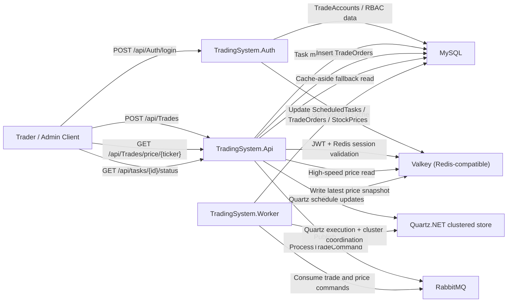
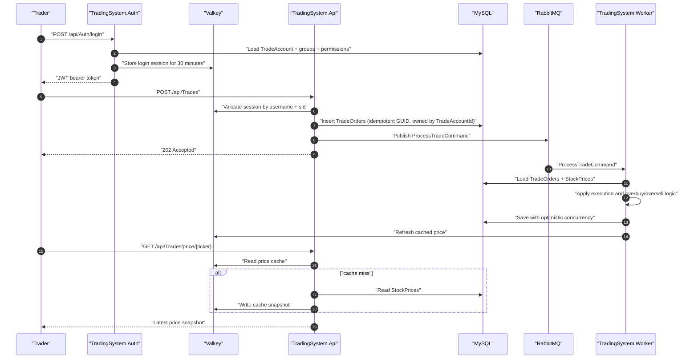
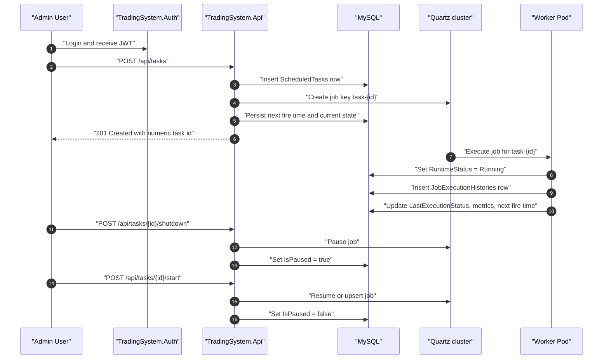
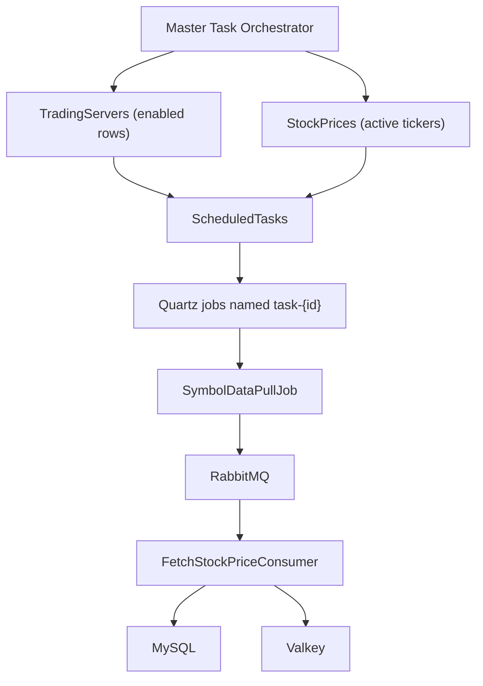
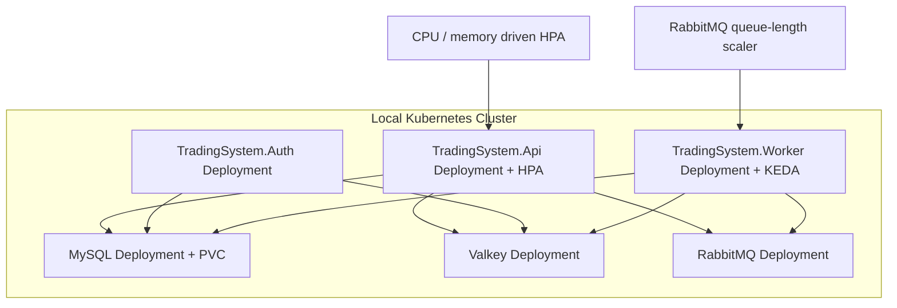

# TradingSystemDemo

## What this solution is trying to demo

This repository demonstrates a trading-system sample that combines:

1. A Quartz.NET scheduler with persistent MySQL storage and distributed worker execution.
2. A cache-aside market data pattern where MySQL is the durable source of truth and Valkey is the fast read model.
3. An asynchronous trading write pipeline where the API writes orders to MySQL first, then publishes work to RabbitMQ.
4. A dedicated authentication service that issues JWT bearer tokens for the other packages.
5. Role and permission-based authorization for admin task control, trader order placement, and read-only monitoring.

The goal is not to build a real exchange. The goal is to demonstrate the platform patterns around:

- scheduler CRUD and monitoring
- clustered background work
- idempotent writes
- optimistic concurrency
- high-speed cache reads
- RBAC and JWT enforcement
- local Docker and local Kubernetes deployment shapes

## What was wrong before

The earlier revision had several mismatches against `BaseDesignProblem.txt` and the intended trading architecture:

- Quartz tasks were identified by job names instead of opaque numeric IDs.
- Task metadata lived mostly inside Quartz, so the REST API did not own a durable task model.
- Task status was partly derived from local scheduler state, which does not scale well across multiple worker pods.
- The demo had no trade account, no JWT auth, and no permission model for task administration.
- Orders were not owned by an authenticated trade account.
- The repository had no dedicated authentication package.
- The previous README diagrams used Mermaid edge labels that GitHub could not parse reliably.

## What is implemented now

- `ScheduledTasks` is a first-class table with opaque numeric IDs, persisted runtime fields, metrics, and history linkage.
- `/api/tasks/{id}` is now numeric-ID based.
- Task control now covers:
  - create
  - read
  - update
  - delete
  - status/history
  - monitoring overview
  - individual shutdown
  - individual start
  - run-now
- Worker-side Quartz listeners update task status in MySQL so monitoring remains meaningful when workers scale out.
- `TradingSystem.Auth` is a separate JWT issuer service.
- Trade accounts, groups, permissions, and account-group mappings are stored in MySQL.
- Login sessions are tracked in Valkey with a configurable 30-minute expiry.
- `POST /api/Trades` now requires a valid authenticated trade account and stores `TradeAccountId` on each order.
- Admin users manage task schedules; non-admin users can still read job status and real-time prices according to their permissions.

## High-level architecture



## Trading request flow



## Numeric task lifecycle



## Dynamic server-based task management



## Local Kubernetes scaling design



## Why the scaling policy is split this way

- `TradingSystem.Api` is stateless and request-driven, so CPU-based HPA is the simplest signal for local clusters.
- `TradingSystem.Worker` should scale based on backlog, not CPU alone, so KEDA watches RabbitMQ queue length.
- Quartz clustering remains in the worker pods, backed by MySQL. That lets multiple worker replicas share scheduled execution safely.
- `TradingSystem.Auth` can stay at one replica locally because JWT issuance is lightweight and token validation in the API is local plus Redis-backed.

## Authorization and account model

### Trade account fields

- `Name`
- `Username`
- `Email`
- `PasswordHash` (HMAC-SHA512)
- `PasswordSalt`
- `CreatedAt`
- `IsDisabled`
- `LastLoginAt`

### Seeded user groups

- `Administrators`
  - can manage accounts
  - can manage tasks
  - can read task status
  - can read prices
  - can place trades
- `Traders`
  - can read task status
  - can read prices
  - can place trades
- `Observers`
  - can read task status
  - can read prices

### Default local admin account

- username: `admin`
- password: `Admin123!ChangeMe`

This is only for local demo bootstrap. Change it for anything beyond local testing.

## Task API surface

### Read and monitoring

- `GET /api/tasks`
- `GET /api/tasks/monitoring/overview`
- `GET /api/tasks/{id}`
- `GET /api/tasks/{id}/status`

### Admin control

- `POST /api/tasks`
- `PUT /api/tasks/{id}`
- `DELETE /api/tasks/{id}`
- `POST /api/tasks/{id}/shutdown`
- `POST /api/tasks/{id}/start`
- `POST /api/tasks/{id}/run-now`

## Auth API surface

- `POST /api/Auth/login`
- `POST /api/Auth/logout`
- `GET /api/Auth/me`
- `GET /api/TradeAccounts`
- `GET /api/TradeAccounts/{id}`
- `POST /api/TradeAccounts`
- `PUT /api/TradeAccounts/{id}`
- `PUT /api/TradeAccounts/{id}/disable`
- `DELETE /api/TradeAccounts/{id}`

## Trading API behavior

- `POST /api/Trades`
  - requires `trades.place`
  - requires a valid JWT
  - requires a valid Redis-backed login session
  - uses client GUID idempotency
  - stores `TradeAccountId`
- `GET /api/Trades/price/{ticker}`
  - requires `prices.read`
  - uses cache-aside reads

## How the overbuy and oversell demo works

This repository still uses a simplified market-pressure model rather than a true order book.

- buy orders first consume queued sell pressure, then available volume
- sell orders first consume queued buy pressure, then replenish available volume
- unmet buy volume increases `PendingBuyVolume`
- unmet sell volume increases `PendingSellVolume`
- price movement comes from:
  - executed volume against the bid
  - queued pressure
  - buy vs sell imbalance

That is enough to demonstrate the high-volume real-time design without hiding the logic behind an exchange engine.

## Comparison with `BaseDesignProblem.txt`

| Base requirement | Status now | Notes |
|---|---|---|
| Background scheduler using Quartz.NET | Implemented | Worker hosts Quartz with MySQL persistent store and clustering. |
| Support simple and cron schedules | Implemented | `ScheduledTasks` supports both `Simple` and `Cron`. |
| Persistent job storage | Implemented | Quartz tables plus `ScheduledTasks` metadata live in MySQL. |
| REST task CRUD | Implemented | Numeric task IDs are exposed through `/api/tasks/{id}`. |
| Task filtering and pagination | Implemented | `GET /api/tasks` supports both. |
| Status, history, and metrics | Implemented | `JobExecutionHistories` plus status fields on `ScheduledTasks`. |
| Disable concurrent execution | Implemented | `MasterOrchestratorJob` and `SymbolDataPullJob` use Quartz non-concurrent execution semantics per job key. |
| Per-server isolated processing | Implemented | Symbol polling tasks carry `ServerId` and `Ticker`. |
| Dynamic child task management | Implemented | Master task reconciles enabled servers and active tickers into child tasks. |
| Idempotent repeated parent runs | Implemented | Master task reuses existing child rows and reactivates stale ones instead of duplicating. |
| Graceful shutdown | Implemented | Quartz hosted service waits for jobs to finish. |

## Fresh local setup with Docker Desktop

### 1. Wipe old local state

```powershell
docker compose down -v --remove-orphans
docker volume rm oscarwmh_mysql_data
```

If the named volume does not exist, Docker will print an error for the second command. That is harmless.

### 2. Rebuild and start everything

```powershell
docker compose build --no-cache
docker compose up -d --build --force-recreate
docker compose ps
```

### 3. Endpoints

- trading API Swagger: [http://localhost:8080/swagger](http://localhost:8080/swagger)
- auth Swagger: [http://localhost:8081/swagger](http://localhost:8081/swagger)
- RabbitMQ management: [http://localhost:15672](http://localhost:15672)
- MySQL: `localhost:3306`
- Valkey: `localhost:6379`

### 4. First login

```powershell
$login = Invoke-RestMethod `
  -Method Post `
  -Uri "http://localhost:8081/api/Auth/login" `
  -ContentType "application/json" `
  -Body (@{
      username = "admin"
      password = "Admin123!ChangeMe"
  } | ConvertTo-Json)

$token = $login.accessToken
$headers = @{ Authorization = "Bearer $token" }
```

### 5. Create a trader account

```powershell
Invoke-RestMethod `
  -Method Post `
  -Uri "http://localhost:8081/api/TradeAccounts" `
  -Headers $headers `
  -ContentType "application/json" `
  -Body (@{
      name = "Demo Trader"
      username = "trader1"
      email = "trader1@tradingsystem.local"
      password = "Trader123!"
      groupNames = @("Traders")
  } | ConvertTo-Json)
```

### 6. Place an authenticated idempotent order

```powershell
$traderLogin = Invoke-RestMethod `
  -Method Post `
  -Uri "http://localhost:8081/api/Auth/login" `
  -ContentType "application/json" `
  -Body (@{
      username = "trader1"
      password = "Trader123!"
  } | ConvertTo-Json)

$traderHeaders = @{ Authorization = "Bearer $($traderLogin.accessToken)" }
$orderId = [guid]::NewGuid()

Invoke-RestMethod `
  -Method Post `
  -Uri "http://localhost:8080/api/Trades" `
  -Headers $traderHeaders `
  -ContentType "application/json" `
  -Body (@{
      orderId = $orderId
      stockTicker = "AMZN"
      bidAmount = 152.25
      volume = 250
      isBuy = $true
      serverId = 1
  } | ConvertTo-Json)
```

Resend the same payload with the same `orderId` to verify idempotency.

### 7. Inspect tasks

```powershell
Invoke-RestMethod -Method Get -Uri "http://localhost:8080/api/tasks" -Headers $headers
Invoke-RestMethod -Method Get -Uri "http://localhost:8080/api/tasks/monitoring/overview" -Headers $headers
```

## Upgrading an existing local MySQL volume

If you want to keep the old Docker volume instead of wiping it, run:

```powershell
cmd /c "docker exec -i tradingsystem-mysql mysql -uroot -prootpassword tradingsystem < upgrade-20260313-market-depth.sql"
```

This script avoids the MySQL Workbench `ADD COLUMN IF NOT EXISTS` issue by checking `INFORMATION_SCHEMA` before each `ALTER TABLE`.

## Local Kubernetes deployment

### Shared idea

The Kubernetes manifests are under [k8s](/C:/z/Hytech/oscarwmh/k8s). They assume:

- MySQL, RabbitMQ, and Valkey run inside the same local cluster namespace
- the app images are built locally as:
  - `tradingsystem-api:local`
  - `tradingsystem-auth:local`
  - `tradingsystem-worker:local`
- API scaling uses HPA
- worker scaling uses KEDA

### Minikube setup

1. Start Minikube and enable metrics:

```powershell
minikube start --cpus=4 --memory=8192
minikube addons enable metrics-server
```

2. Install KEDA:

```powershell
helm repo add kedacore https://kedacore.github.io/charts
helm repo update
helm install keda kedacore/keda --namespace keda --create-namespace
```

3. Build images directly into Minikube:

```powershell
minikube image build -t tradingsystem-api:local -f TradingSystem.Api/Dockerfile .
minikube image build -t tradingsystem-auth:local -f TradingSystem.Auth/Dockerfile .
minikube image build -t tradingsystem-worker:local -f TradingSystem.Worker/Dockerfile .
```

4. Apply manifests:

```powershell
kubectl apply -f k8s/namespace.yaml
kubectl create configmap trading-init-sql --from-file=init.sql -n trading-system --dry-run=client -o yaml | kubectl apply -f -
kubectl apply -f k8s/secrets.yaml
kubectl apply -f k8s/configmap.yaml
kubectl apply -f k8s/mysql.yaml
kubectl apply -f k8s/valkey.yaml
kubectl apply -f k8s/rabbitmq.yaml
kubectl apply -f k8s/tradingsystem-auth.yaml
kubectl apply -f k8s/tradingsystem-api.yaml
kubectl apply -f k8s/tradingsystem-worker.yaml
kubectl apply -f k8s/tradingsystem-api-hpa.yaml
kubectl apply -f k8s/tradingsystem-worker-trigger-authentication.yaml
kubectl apply -f k8s/tradingsystem-worker-scaledobject.yaml
```

5. Access NodePort services:

```powershell
minikube service tradingsystem-api -n trading-system --url
minikube service tradingsystem-auth -n trading-system --url
```

### Kind setup

1. Create the cluster:

```powershell
kind create cluster --name trading-system --config k8s/kind-cluster.yaml
```

2. Install metrics-server and KEDA:

```powershell
kubectl apply -f https://github.com/kubernetes-sigs/metrics-server/releases/latest/download/components.yaml
helm repo add kedacore https://kedacore.github.io/charts
helm repo update
helm install keda kedacore/keda --namespace keda --create-namespace
```

3. Build and load local images:

```powershell
docker build -t tradingsystem-api:local -f TradingSystem.Api/Dockerfile .
docker build -t tradingsystem-auth:local -f TradingSystem.Auth/Dockerfile .
docker build -t tradingsystem-worker:local -f TradingSystem.Worker/Dockerfile .

kind load docker-image tradingsystem-api:local --name trading-system
kind load docker-image tradingsystem-auth:local --name trading-system
kind load docker-image tradingsystem-worker:local --name trading-system
```

4. Apply the same manifests listed in the Minikube section.

5. Access services through the `kind` port mappings:

- API: [http://localhost:8080/swagger](http://localhost:8080/swagger)
- Auth: [http://localhost:8081/swagger](http://localhost:8081/swagger)

## Dependency and licensing policy

For local development, the stack should stay on components that are free to run locally:

- RabbitMQ: `rabbitmq:4.2-management-alpine`
- Valkey: `valkey/valkey:9.0-alpine`

Valkey is used as the Redis-compatible cache so the sample keeps the Redis protocol without pulling local development toward newer licensing ambiguity in upstream Redis packaging.

## Files to know

- [BaseDesignProblem.txt](/C:/z/Hytech/oscarwmh/BaseDesignProblem.txt)
- [init.sql](/C:/z/Hytech/oscarwmh/init.sql)
- [upgrade-20260313-market-depth.sql](/C:/z/Hytech/oscarwmh/upgrade-20260313-market-depth.sql)
- [docker-compose.yml](/C:/z/Hytech/oscarwmh/docker-compose.yml)
- [TradingSystem.Api](/C:/z/Hytech/oscarwmh/TradingSystem.Api)
- [TradingSystem.Auth](/C:/z/Hytech/oscarwmh/TradingSystem.Auth)
- [TradingSystem.Worker](/C:/z/Hytech/oscarwmh/TradingSystem.Worker)
- [k8s](/C:/z/Hytech/oscarwmh/k8s)

## Remaining demo gaps

- The pricing engine is illustrative, not a real limit-order book.
- There is no refresh-token flow yet; login is access-token only.
- Secrets in `docker-compose.yml` and `k8s/secrets.yaml` are demo defaults, not production secret management.
- The local Kubernetes manifests are intentionally direct YAML for clarity; a production deployment would usually move this to Helm or Kustomize overlays.

## Verification used for this revision

```powershell
dotnet build TradingSystem.slnx
docker compose config
```
